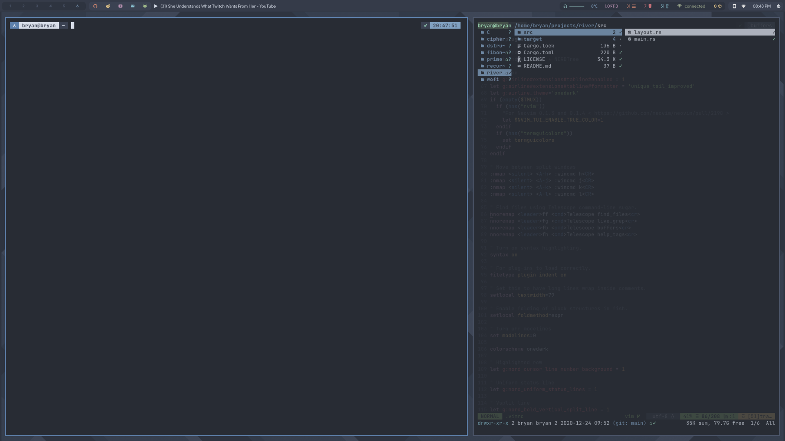
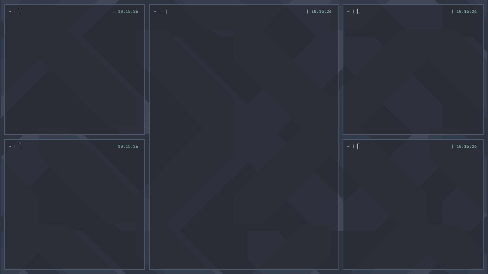

# rivertab - `rivertiler tab`
A tabbed layout

# riverhive - `rivertiler hive`
I got the idea from Krohnkite which probably took it from dwm.

# rivergrid - `rivertiler grid`
Grid layout

I've not yet implemented mod-master-count and master_width_factor.
